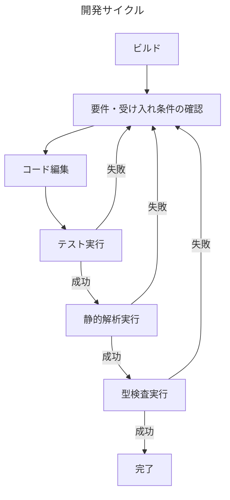

# agile-calculator
アジャイル開発の生産性を向上させるための、JiraやGitHubのデータを分析するPythonクライアントです。

# インセプションデッキ

## 我々はなぜここにいるのか？
あなたは、開発組織のアジャイルコーチです。  
また、Pythonに長けたDevOpsエンジニアです。  
あなたは、チームの生産性を向上させるために、JiraやGitHubのデータを分析します。  
Pythonを利用しJiraやGitHubのデータを、抽出・加工し可視化することで、開発サイクル改善の施策を推進します。

## エレベーターピッチ
[ プロダクト開発の生産性を向上 ]したい  
[ JiraやGitHubユーザーのITエンジニア ]向けの  
[ agile-calculator ]というプロダクトは  
[ JiraやGitHub向けのPythonクライアント ]です。  
これは[ Four Keysといった各種開発サイクルの指標計測 ]ができ、  
[ Findy Team+ ]とは違って  
[ JiraやGitHubのクレデンシャルさえあれば、無料で利用できるという特徴 ]が備わっている。

## やらないことリスト
- 本プロジェクトの、早すぎる最適化
  - 本プロジェクトの、過度なドキュメント化
  - 本プロジェクトの、過度なテストカバレッジの追求
  - 本プロジェクトの、過度なコードのリファクタリング
  - 本プロジェクトの、過度な機能追加

## 「ご近所さん」を探せ
- このリポジトリで開発ツールを開発する、GEMINI、つまりあなたです。
- このリポジトリを管理して、ツールを利用する人、つまり私です。
- 開発チームのメンバー、つまり分析対象の人たちです。

## 解決案を描く
### システム構成
[ユーザーストーリーマッピング](https://www.canva.com/design/DAGc0-KJrLg/_1o6i9n5LO1YdSLCs_IXFA/view?utm_content=DAGc0-KJrLg&utm_campaign=designshare&utm_medium=link2&utm_source=uniquelinks&utlId=h3a1ac8b254)

- tasks
  - extractors: 分析対象となるサービスのAPIからデータを取得するためのモジュールを提供します。
  - transformers: 取得したデータを用途に沿って加工(MapReduce)するためのモジュールを提供します。
  - loaders: 加工したデータを用途に則した各形式に出力するためのモジュールを提供します。
- records
  - extracted: extractorが取得したデータを保持し、後段の処理に必要な振る舞いを持たせたモジュールを提供します。
  - transformed: transformerが加工(MapReduce)したデータを保持するためのモジュールを提供します。
- workflows: データを取得し、加工し、出力するための一連の流れを管理するモジュールを提供します。
  - transforming
    - loading

### 開発手順
ビルドの実行は以下です。
```bash
docker compose build
```

本プロジェクトのコマンドは、以下のように`docker compose run --rm jupyter`を先頭につけて実行します。
```bash
docker compose run --rm jupyter <command>
```

例えば、テスト実行は以下です
```bash
docker compose run --rm jupyter uv run pytest
```

静的解析実行は以下です
```bash
docker compose run --rm jupyter uv run ruff check --fix
```

型検査実行は以下です
```bash
docker compose run --rm jupyter uv run ty check
```

# ワーキングアグリーメント

以下の開発サイクルを守ることを、ワーキングアグリーメントとします。

